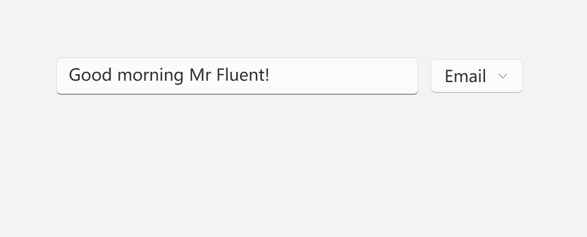
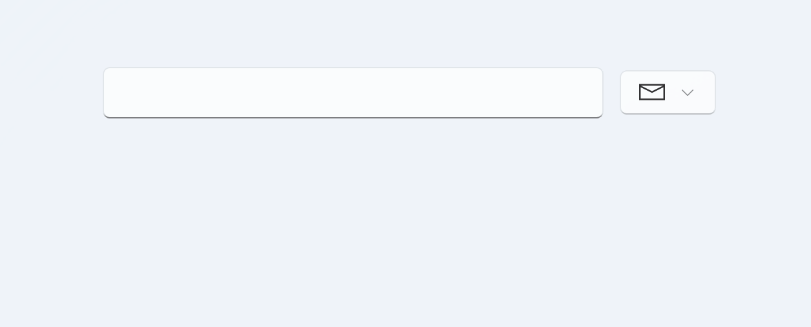

# DropDownButton

类型: INKORE.UI.WPF.Modern.Controls.DropDownButton

继承: System.Windows.Controls.Button

## 属性

### CornerRadius

- **类型**: `DependencyProperty`
- **默认值**: `0`
- **描述**: 定义按钮的边角半径，以 `CornerRadius` 对象表示。该值指定按钮四个角的圆角半径大小。较大的值将产生更圆的角。

---

### ShowChevronArrow

- **类型**: `DependencyProperty`
- **默认值**: `true`
- **描述**: 指示是否显示按钮上的下拉箭头。如果设置为 `true`，则会显示箭头，否则不显示。

---

### UseSystemFocusVisuals

- **类型**: `DependencyProperty`
- **默认值**: `false`
- **描述**: 指示是否使用系统提供的焦点可视化效果。如果设置为 `true`，则按钮获得焦点时将使用系统默认的焦点可视化效果。

---

### FocusVisualMargin

- **类型**: `DependencyProperty`
- **默认值**: `0`
- **描述**: 定义焦点可视化效果的边距。该值指定了焦点可视化效果与按钮边缘之间的距离。

---

### Flyout

- **类型**: `DependencyProperty`
- **默认值**: `null`
- **描述**: 指定与按钮关联的飞出菜单（`FlyoutBase`）。当按钮被点击或悬停时，此飞出菜单将显示。

---

### FlyoutOpeningMode

- **类型**: `DependencyProperty`
- **默认值**: `OnClick`
- **描述**: 定义飞出菜单的打开模式。

---

这些属性用于 `DropDownButton` 类，可以通过设置它们来配置按钮的外观和行为。

## 方法
- **OpenFlyout()**: 打开与按钮关联的飞出菜单。
- **CloseFlyout()**: 关闭与按钮关联的飞出菜单。

## 事件处理
- **OnFlyoutOpened(object sender, object e)**: 当飞出菜单打开时调用的事件处理方法。

- **OnFlyoutClosed(object sender, object e)**: 当飞出菜单关闭时调用的事件处理方法。

## 内部字段
- **IsFlyoutOpen**: `bool`, 标识飞出菜单是否已打开的内部字段

## Automation
- **OnCreateAutomationPeer()**: 
- **DropDownButtonAutomationPeer**:

## 样例
### 创建一个 DropDownButton
```xaml
<ui:DropDownButton Content="Email">
    <ui:DropDownButton.Flyout>
        <ui:MenuFlyout Placement="Bottom">
            <MenuItem Header="Send"/>
            <MenuItem Header="Reply"/>
            <MenuItem Header="Reply All"/>
        </ui:MenuFlyout>
    </ui:DropDownButton.Flyout>
</ui:DropDownButton>
```

下面是等效的 C# 代码

```csharp
MenuFlyout menuFlyout = new MenuFlyout { Placement = FlyoutPlacementMode.Bottom };

MenuItem newMenuItem = new MenuItem();
string[] items = ["Send", "Reply", "Reply All"]
for (i=0; i < item.Length; i++)
{
    newMenuItem.Header = items[i];
    menuFlyout.Items.Add(newMenuItem);
}

DropDownButton dropDownButton = new DropDownButton { Content = "Email", Flyout = menuFlyout };
```

效果:



### 带有图标的 DropDownButton

```xaml
<ui:DropDownButton AutomationProperties.Name="Email">
    <ui:DropDownButton.Content>
        <ui:FontIcon FontFamily="Segoe MDL2 Assets" Glyph="{x:Static ui:SegoeIcons.Mail}"/>
    </ui:DropDownButton.Content>
    <ui:DropDownButton.Flyout>
        <ui:MenuFlyout Placement="Bottom">
            <MenuItem Header="Send">
                <MenuItem.Icon>
                    <ui:FontIcon FontFamily="Segoe MDL2 Assets" Glyph="{x:Static ui:SegoeIcons.Send}"/>
                </MenuItem.Icon>
            </MenuItem>
            <MenuItem Header="Reply">
                <MenuItem.Icon>
                    <ui:FontIcon FontFamily="Segoe MDL2 Assets" Glyph="{x:Static ui:SegoeIcons.MailReply}"/>
                </MenuItem.Icon>
            </MenuItem>
            <MenuItem Header="Reply All">
                <MenuItem.Icon>
                    <ui:FontIcon FontFamily="Segoe MDL2 Assets" Glyph="{x:Static ui:SegoeIcons.MailReplyAll}"/>
                </MenuItem.Icon>
            </MenuItem>
        </ui:MenuFlyout>
    </ui:DropDownButton.Flyout>
</ui:DropDownButton>
```

下面是等效的 C# 代码：

```csharp
DropDownButton dropDownButton = new DropDownButton();
dropDownButton.AutomationProperties.Name = "Email";

FontIcon contentFontIcon = new FontIcon();
contentFontIcon.FontFamily = new FontFamily("Segoe MDL2 Assets");
contentFontIcon.Glyph = SegoeIcons.Mail;
dropDownButton.Content = contentFontIcon;

MenuFlyout menuFlyout = new MenuFlyout();
menuFlyout.Placement = FlyoutPlacementMode.Bottom;

(string Header, SegoeIcons Glyph)[] menuItems = {
    ("Send", SegoeIcons.Send),
    ("Reply", SegoeIcons.MailReply),
    ("Reply All", SegoeIcons.MailReplyAll)
};

foreach (var item in menuItems)
{
    MenuItem menuItem = new MenuItem();
    menuItem.Header = item.Header;

    FontIcon icon = new FontIcon();
    icon.FontFamily = new FontFamily("Segoe MDL2 Assets");
    icon.Glyph = item.Glyph;
    menuItem.Icon = icon;

    menuFlyout.Items.Add(menuItem);
}

dropDownButton.Flyout = menuFlyout;
```

效果：



## 参考

[System.Windows.Controls.Button](Button.md)
