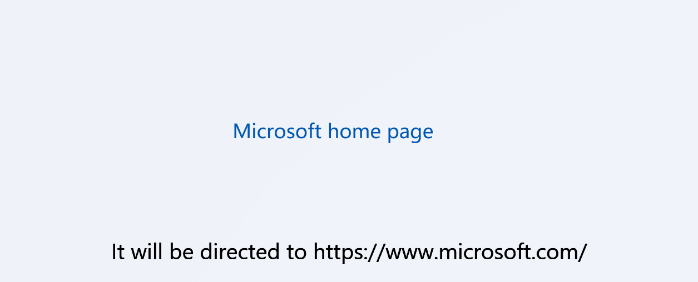

# HyperlinkButton

类型: INKORE.UI.WPF.Modern.Controls.HyperlinkButton

继承: System.Windows.Controls.Primitives.ButtonBase

`HyperlinkButton` 类是一个按钮控件，用于在 WPF 应用程序中创建类似超链接的按钮, 继承自 `ButtonBase` 类。

## 构造函数

- **HyperlinkButton()**: 创建一个新的 `HyperlinkButton` 实例。

## 属性

### NavigateUri

- 类型：`Uri`
- 默认值：`null`

- 描述：超链接的目标 URI。

---

### **RaiseHyperlinkClicks**

- 类型：`bool`
- 默认值：`true`

- 描述：是否在点击按钮时触发超链接点击事件。

---

### TargetName

- 类型：`string`
- 默认值：`null`

- 描述：超链接的目标名称。

---

### UseSystemFocusVisuals

- 类型：`bool`
- 默认值：`false`

- 描述：是否使用系统提供的焦点可视化效果。

---

### FocusVisualMargin

- 类型：`Thickness`
- 默认值：`{0,0,0,0}`
- 描述：焦点可视化效果的边距。

---

## 方法

1. **OnClick()**: 当按钮被点击时调用的方法，用于触发超链接点击事件。
2. **AutomationButtonBaseClick()**: 执行按钮点击的内部方法，用于触发按钮点击事件。
3. **OnRequestNavigate(object sender, RequestNavigateEventArgs e)**: 处理超链接点击事件的方法，根据超链接的 URI 进行导航操作。

## 事件处理方法

- **OnNavigateUriChanged(DependencyObject d, DependencyPropertyChangedEventArgs e)**: 当 NavigateUri 属性值发生变化时调用的方法，用于更新超链接的目标 URI。
- **OnTargetNameChanged(DependencyObject d, DependencyPropertyChangedEventArgs e)**: 当 TargetName 属性值发生变化时调用的方法，用于更新超链接的目标名称。

## Automation

- **OnCreateAutomationPeer()**: 创建自定义控件的自动化对等体。
- **HyperlinkButtonAutomationPeer**: `HyperlinkButton` 控件的自动化对等体类，用于支持 UI 自动化。

## 内部字段

- **m_hyperlink**: 内部保存的 `Hyperlink` 对象，用于实现超链接功能。

## 样例

### 创建一个 HyperlinkButton

```xaml
<ui:HyperlinkButton Content="Microsoft home page" NavigateUri="http://www.microsoft.com" />
```

等效的 C# 代码如下

```csharp
System.Uri uri = new Uri("http://www.microsoft.com");
HyperlinkButton hyperlinkButton = new HyperlinkButton() { Content = "Microsoft home page", NavigateUri = uri };
```

效果：

