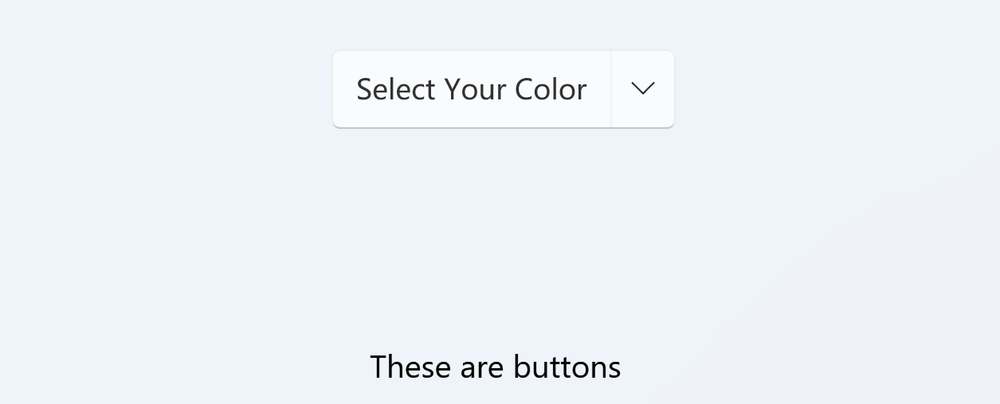

# SplitButton

类型：INKORE.UI.WPF.Modern.Controls.SplitButton

继承：System.Windows.Controls.ContentControl

接口：System.Windows.Input.ICommandSource

`SplitButton` 类用于创建一个分隔按钮，其中包含一个主按钮和一个附加的下拉按钮，继承自 `ContentControl` 类

## 属性

### UseSystemFocusVisuals

- 类型：`bool`
- 默认值：`false`
- 描述：设置是否使用系统焦点视觉效果。

---

### FocusVisualMargin

- 类型：`Thickness`
- 默认值：`new Thickness(0)`
- 描述：设置焦点视觉效果的边距。

---

### Command

- 类型：`ICommand`
- 默认值：`null`
- 描述：设置与按钮关联的命令。

---

### CommandParameter

- 类型：`object`
- 默认值：`null`
- 描述：设置命令的参数

---

### CommandTarget

- 类型：`IInputElement`
- 默认值：`null`
- 描述：设置命令的目标

---

### Flyout

- 类型：`FlyoutBase`
- 默认值：`null`
- 描述：设置下拉菜单的内容。

## 方法

- **OpenFlyout()**: 打开下拉菜单。此方法用于手动打开 `SplitButton` 的下拉菜单。
- **CloseFlyout()**: 关闭下拉菜单。此方法用于手动关闭 `SplitButton` 的下拉菜单。

## 事件

- **Click(object sender, object e)**: 当主按钮被点击时触发。这是一个自定义事件，用于处理 `SplitButton` 主按钮的点击操作。

<!-- 关于这个 SpiltButton 的一些内部操作逻辑不详细写了hhh -->

## 样例

### 用 SplitButton 创建一个选择颜色的控件

```xaml
<ui:SplitButton Height="40">
    Select Your Color
    <ui:SplitButton.Flyout>
        <ui:Flyout Placement="Bottom">
            <StackPanel Orientation="Horizontal">
                <Button>
                    <Button.Template>
                        <ControlTemplate>
                            <Grid Height="50" Width="50" Margin="5">
                                <Border>
                                    <Rectangle Fill="AliceBlue" RadiusX="10" RadiusY="10"/>
                                </Border>
                            </Grid>
                        </ControlTemplate>
                    </Button.Template>
                </Button>
                <Button>
                    <Button.Template>
                        <ControlTemplate>
                            <Grid Height="50" Width="50" Margin="5">
                                <Border>
                                    <Rectangle Fill="BurlyWood" RadiusX="10" RadiusY="10"/>
                                </Border>
                            </Grid>
                        </ControlTemplate>
                    </Button.Template>
                </Button>
                <Button>
                    <Button.Template>
                        <ControlTemplate>
                            <Grid Height="50" Width="50" Margin="5">
                                <Border>
                                    <Rectangle Fill="Aquamarine" RadiusX="10" RadiusY="10"/>
                                </Border>
                            </Grid>
                        </ControlTemplate>
                    </Button.Template>
                </Button>
                <Button>
                    <Button.Template>
                        <ControlTemplate>
                            <Grid Height="50" Width="50" Margin="5">
                                <Border>
                                    <Rectangle Fill="DarkOliveGreen" RadiusX="10" RadiusY="10"/>
                                </Border>
                            </Grid>
                        </ControlTemplate>
                    </Button.Template>
                </Button>
            </StackPanel>
        </ui:Flyout>
    </ui:SplitButton.Flyout>
</ui:SplitButton>
```

效果：



