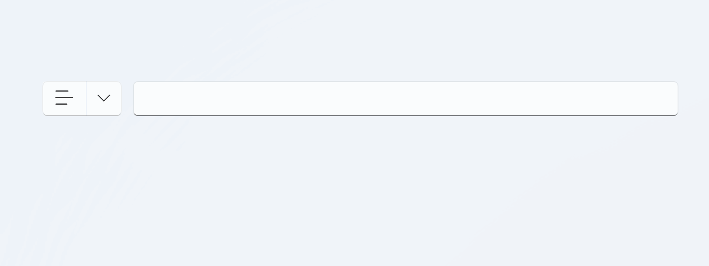

# ToggleSplitButton

类型：INKORE.UI.WPF.Modern.Controls.ToggleSplitButton

继承：INKORE.UI.WPF.Modern.Controls.SplitButton

## 属性

### IsChecked

- 类型：`bool`
- 默认值：`false`
- 描述：按钮是否处于选中状态。

## 事件处理

**IsCheckedChanged**：当这个按钮 IsCheck 的属性发生改变时触发

## 方法

**Toggle()**：切换按钮的当前状态。如果按钮已选中，则取消选中，反之亦然。

## 样例

### 使用 `ToggleSplitButton` 制作一个列表样式选择器



前端 xaml:

```xaml
<StackPanel Orientation="Horizontal"  HorizontalAlignment="Center">
    <Grid Margin="5">
        <ui:ToggleSplitButton x:Name="ListFormat" Height="32">
            <ui:FontIcon x:Name="Mainico" Glyph="{x:Static ui:SegoeIcons.List}"/>
            <ui:ToggleSplitButton.Flyout>
                <ui:Flyout Placement="Bottom">
                    <StackPanel Orientation="Horizontal">
                        <Grid Margin="5">
                            <Button x:Name="List" Click="List_Click">
                                <ui:FontIcon Glyph="{x:Static ui:SegoeIcons.CheckList}"/>
                            </Button>
                        </Grid>
                        <Grid Margin="5">
                            <Button x:Name="BulletedList" Click="BulletedList_Click">
                                <ui:FontIcon Glyph="{x:Static ui:SegoeIcons.BulletedList}" />
                            </Button>
                        </Grid>
                    </StackPanel>
                </ui:Flyout>
            </ui:ToggleSplitButton.Flyout>
        </ui:ToggleSplitButton>
    </Grid>
    <Grid Margin="5">
        <TextBox x:Name="txt" Height="10" Width="500">
        </TextBox>
    </Grid>
</StackPanel>
```

后端 C#

```csharp
private void List_Click(object sender, RoutedEventArgs e)
{
    ListFormat.IsChecked = true;
    Mainico.Glyph = SegoeIcons.CheckList;
    txt.Text = "1. ";
}

private void BulletedList_Click(object sender, RoutedEventArgs e)
{
    ListFormat.IsChecked = true;
    Mainico.Glyph = SegoeIcons.BulletedList;
    txt.Text = "· ";
}
```

## 参考

[SplitButton](SplitButton.md)
